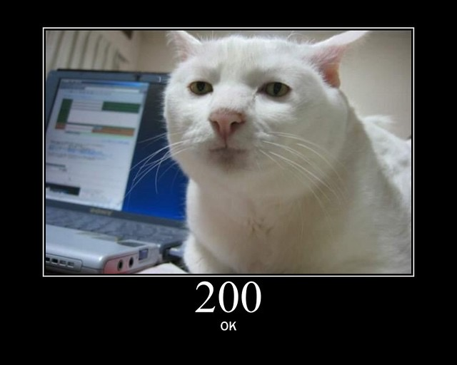

# Simple HTTP Server

## Overview

This project is a simple HTTP server implemented in C. It serves as an educational tool to understand the basics of how HTTP servers work, including how to handle HTTP requests and serve HTML files. The server demonstrates fundamental concepts such as socket programming, multi-threading, and HTTP protocol handling.


## Goal

- **Input:** Run `server.c`.
- **System:** Source code of `server.c`.
- **Output:** Serve the `index.html` file on `localhost:8080`, displaying an HTML page with an image of a cat.

## Features

- **Socket Creation:** Establishes a server socket.
- **Binding:** Binds the socket to an IP address and port.
- **Listening:** Listens for incoming connections.
- **Handling Requests:** Accepts client connections and creates threads to handle each request.
- **Serving Files:** Responds with the contents of `index.html`.

## Usage

1. **Clone the Repository:**
   ```sh
   git clone <repository-url>
   ```
2. **Build the Project:**
   ```sh
   cd <repository-directory>
   make
   ```
3. **Run the Server:**
   ```sh
   ./server
   ```
4. **Access the Server:**
   Open a web browser and navigate to `http://localhost:8080` to view the `index.html` file.

## Development Notes

This project involved implementing a simple HTTP server in C. During development, I encountered several challenges, including handling different file types and implementing full HTTP request handling. I used ChatGPT as a resource for guidance on specific technical issues and to understand complex concepts.

### Limitations
- **File Handling:** Currently only supports `index.html` and JPEG images. Other file types or more complex scenarios are not handled.
- **Response Handling:** Limited to basic error handling and does not cover all HTTP features.

This project served as a valuable learning experience in network programming and C. Future improvements could include broader file type support and more robust error handling.

